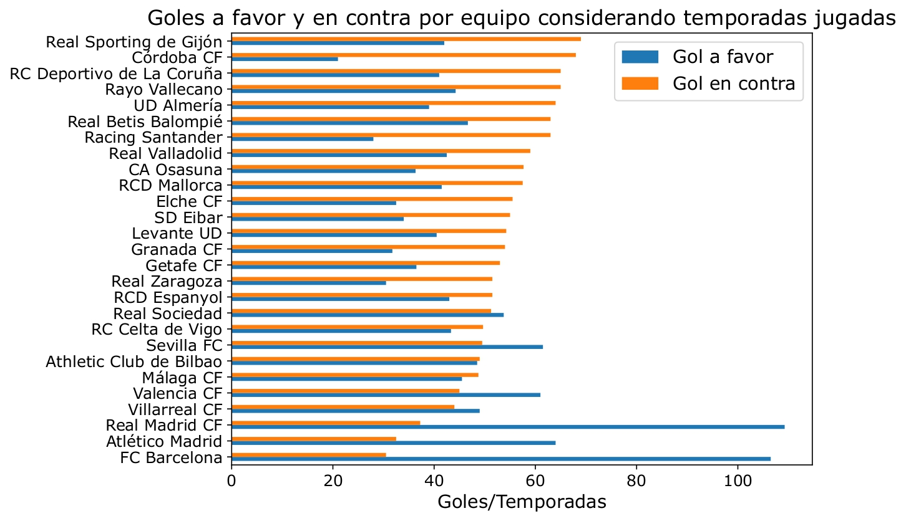
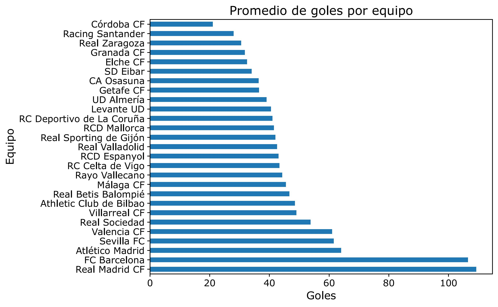
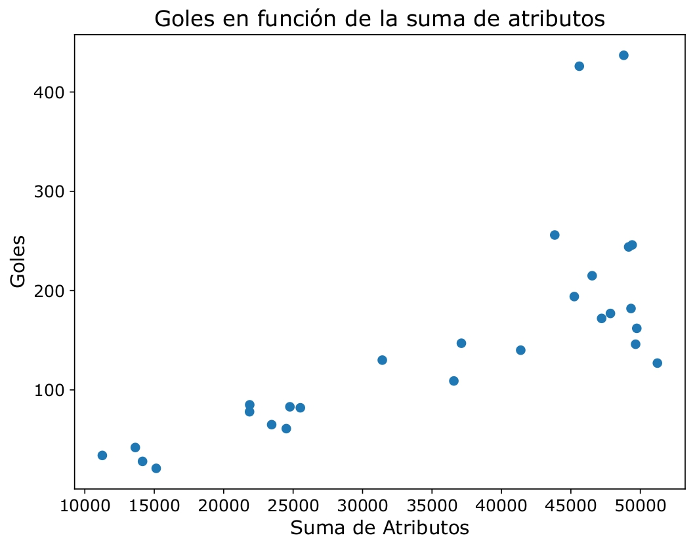

# Análisis Liga Española ⚽

Análisis exploratorio de la **Liga Española de Fútbol** entre las temporadas 2011/2012 y 2014/2015, enfocado en rendimiento de equipos y jugadores a partir de datos de partidos, planteles y atributos.

---

## Estructura del proyecto

```
Laboratorio de Datos/
│
├── equipo_esp.csv          # Información de los equipos
├── plantel_esp.csv         # Planteles por temporada
├── partido_esp.csv         # Resultados de partidos
├── jugador.csv             # Información de jugadores
├── atributos.csv           # Atributos variables por fecha (potencial, velocidad, etc.)
│
├── analisis.py             # Script principal con consultas y visualizaciones
│
├── imagenes/               # Gráficos generados
│   ├── goles_favor_contra.png
│   ├── goles_promedios.png
│   └── goles_convertidos.png
│
└── README.md
```

---

## Temporadas analizadas

Se seleccionaron las temporadas **2011/2012 a 2014/2015** como criterio de consistencia: son las que presentan menor variación en el número de partidos jugados entre sí (diferencia menor a 20 partidos por temporada).

---

## Dependencias

```
pandas
duckdb
numpy
matplotlib
seaborn
```

Instalación:
```bash
pip install pandas duckdb numpy matplotlib seaborn
```

---

## Visualizaciones

### Goles a favor y en contra por equipo



### Promedio de goles por equipo



### Diferencia de goles de local vs visitante



---

## Análisis

### Rendimiento por equipo

El equipo con más victorias a lo largo del período fue el **FC Barcelona**, mientras que el equipo con mayor diferencia de goles también fue el **FC Barcelona**. El equipo con más goles a favor fue el **Real Madrid CF**. En cuanto a derrotas, el equipo más perdedor varió por año: Granada CF (2012), Rayo Vallecano (2013), UD Almería (2014) y Levante UD (2015). El equipo con más empates en 2015 fue el **RC Deportivo de La Coruña**.

### Goles

Real Madrid CF y FC Barcelona presentan un promedio de goles muy superior al resto, lo que refleja su superioridad ofensiva. En la mayoría de los equipos se observa que los goles en contra superan a los goles a favor, lo que sugiere un nivel defensivo bajo en la liga. Al normalizar por temporadas jugadas, el FC Barcelona resulta ser el equipo con menos goles en contra, no el SD Eibar como podría parecer sin normalizar.

En cuanto a la diferencia de goles de local vs visitante, la mayoría de los equipos convierte más goles jugando de local. El Real Madrid CF es el equipo con mayor diferencia, seguido por el Atlético de Madrid y el FC Barcelona.

### Jugadores

El equipo más ganador (FC Barcelona) contó con jugadores como Messi, Neymar, Iniesta, Xavi, Busquets, entre otros. El jugador que perteneció a más equipos fue **Tono**, que cambió de equipo en cada temporada (4 equipos en total). El jugador con menor variación de potencial a lo largo del período — medida con desviación estándar, entre quienes jugaron todas las temporadas — fue **Matias Autret**.

### Atributos vs rendimiento

Se observa una tendencia lineal positiva entre la suma de atributos de los jugadores de un equipo y los goles convertidos: equipos con mejores jugadores tienden a convertir más goles. Sin embargo, esta relación no es garantía: Atlético Madrid y Valencia CF tienen atributos altos pero goles por temporada relativamente bajos. Al normalizar por temporadas jugadas y cantidad de jugadores, los outliers claros son Real Madrid CF y FC Barcelona.

---

## Fuente de datos

Datos de la Liga Española extraídos de bases de datos de rendimiento deportivo (SoFIFA).